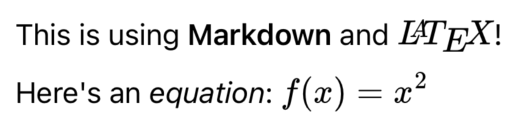

# LaTeXSwiftUI

A fork of https://github.com/colinc86/LaTeXSwiftUI that supports Markdown. See the [original](https://github.com/colinc86/LaTeXSwiftUI) for documentation. It basically works the same except that you can use Markdown.



Code:

```swift
LaTeX("This is using **Markdown** and $\\LaTeX$! Here's an _equation_: $f(x)=x^2$")
```
